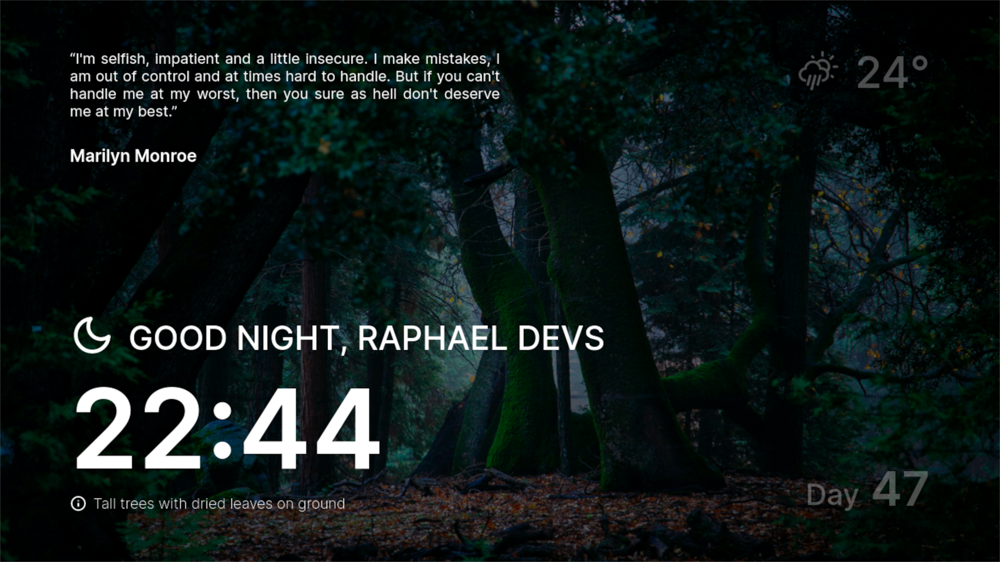

<h1 align="center">
  My Clock App ⌚🖥
</h1>

  

## 🖥 Projeto

Esse projeto é um pequeno dashboard pessoal inspirado no <a href="https://momentumdash.com/">Momentum Dashboard</a>,
uma extensão para Chrome que muda o jeito como você vê novas abas do navegador.

## 💡 Motivação

A principal motivação foi customizar as novas abas do meu navegador, então conheci o <a href="https://momentumdash.com/">Momentum Dashboard</a>
e me baseei nele para fazer a minha versão.

## ⚙️ Tecnologias
- ReactJS
- Styled Components
- Fetch API

## ✏ Layout
👁 [Ver layout](https://www.figma.com/file/G03ZoveN2gbnziqiFTRRDU/Clock-App)

📝 [Duplicar layout](https://www.figma.com/file/G03ZoveN2gbnziqiFTRRDU/Clock-App/duplicate)

## 🛠 Funcionalidades

- [x] Exibir hora no formato 24h
- [x] Exibir mensagem dinâmica com base na hora do dia
- [x] Exibir dia do ano
- [x] Exibir clima
- [x] Buscar imagens aleatórias do Unsplash e exibir pequena descrição
- [ ] Exibir uma frase aleatória

## 👨‍💻 Tasks técnicas

- [x] Criar interface base
  - [x] Grid
  - [x] Separar components
- [x] Exibir hora
  - [x] Criar state para hora e atualizar a cada segundo
  - [x] Formatar hora
- [x] Calcular dia do ano
- [x] Mensagem dinâmica com base na hora do dia
  - [x] Criar função para recuperar hora do dia ('morning', 'afternoon', 'night')
  - [x] Exibir ícone dinâmico com base na hora do dia
    - [x] Criar componente switch para os icones
- [x] Exibir clima usando a API do <a href="https://openweathermap.org">Open Weather Map</a> com base na geolocalização atual
  - [x] Criar função para recuperar latitude e longitude atual
  - [x] Fazer requisição e recuperar temperatura e código do ícone
  - [x] Exibir ícones dinâmicos com base no clima e hora do dia
    - [x] Criar componente switch para os ícones
- [x] Buscar imagens aleatórias usando API do Unsplash e uma descrição da imagem
  - [x] Fazer requisição no useEffect e recuperar valor para um state
  - [x] Passar URL da imagem via props para componente principal
  - [x] Recuperar URL no Styled Compoents e colocar no `background: url()`
  - [x] Exibir descrição da imagem
    - [x] Criar função para converter descrição para title case
- [ ] Encontrar API para buscar de frases
